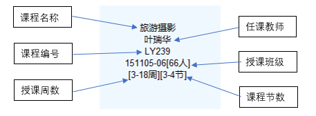

# 图书馆座位预约管理系统(DEMO)

## 一、功能概述
>  * 从<strong>“课程总表.xls”</strong>中读入课程信息。并设计座位使用情况Excel表格存储各个座位状态。
>  * 根据课程信息的内容（节数、上课周数、上课班级）等内容确定<strong>某个时间某个座位是否可用</strong>。被占用时显示“被\*\*\*占用”，空闲时显示“剩余空闲时间\*\*分钟”。
>  * 实现UI界面，完成相关内容的显示和操作交互。

## 二、相关约定
>  * 课程总表中的条目的内容结构如下<em>（注意：可能有多门课程在同一单元格内显示）</em>
     
    
>>  * 学号：前面为班级号，后2位是班级内学号，表中默认每一行是一个班级的课表。例如：15110501是旅行社5班1号。
>>  * 授课周数：默认2019-03-04~2019-03-10为第一周，每周周一为一周的第一天。
>>  * 授课时间：授课时间安排如下表。 
>>      <table>
>>      <tr>
>>      <td>第一节[1,2]</td>
>>      <td>8:00 ~ 9:40</td>
>>      </tr>
>>      <tr>
>>      <td>第二节[3,4]</td>
>>      <td>10:00 ~ 11:40</td>
>>      </tr>
>>      <tr>
>>      <td>第三节[5,6]</td>
>>      <td>13:30 ~ 15:10</td>
>>      </tr>
>>      <tr>
>>      <td>第四节[7,8]</td>
>>      <td>15:30 ~ 17:10</td>
>>      </tr>
>>      <tr>
>>      <td>第五节[9,10]</td>
>>      <td>18:00 ~ 19:40</td>
>>      </tr>
>>      </table>
>   * 关于座位占用的相关约定：阅览室中有一些固定分配给某个同学的座位。只要这个同学没课，就显示为占用；有课时则为空闲，时间根据授课时间决定。
>   * 目前考虑阅览室有10个座位，默认都已分配给不同班级的同学，例如：151105班的A同学分配到了座位1。
    
## 三、开发要求
>   * 使用Java语言开发的Windows应用程序，不可以使用MySQL等数据库组件。读取Excel以及UI实现可以借助相关工具以及组件包。
>   * 程序演示时间为2019-05-18 13：30，组号排序：15
>   * 应当演示release之后的可执行程序（可安装/绿色程序），即可以脱离开发环境独立运行。

## 四、模块分工
>   * 王高杰：UI界面以及相关用户操作
>   * 刘华罗：关于时间和座位相关操作
>   * 张日松：Excel课程读写相关操作

